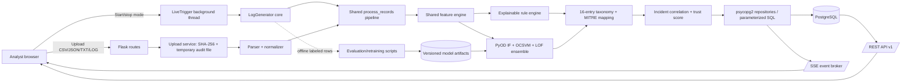
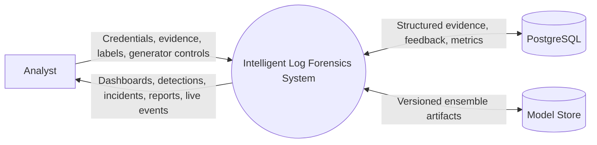
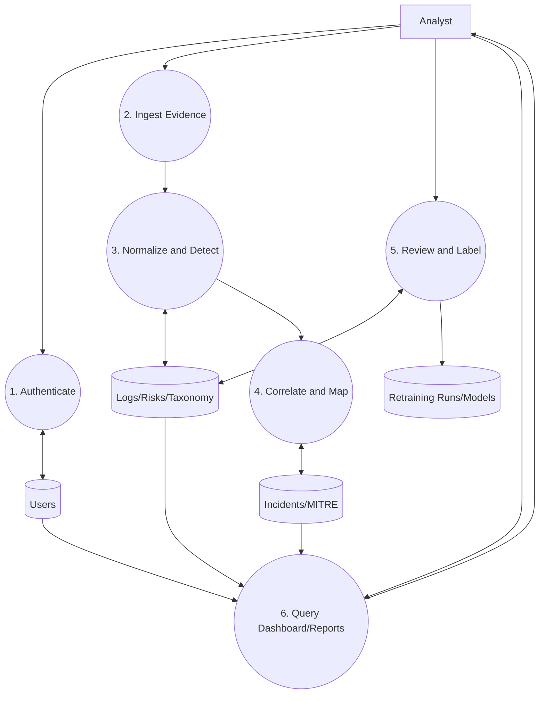
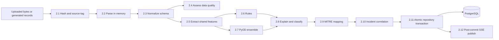
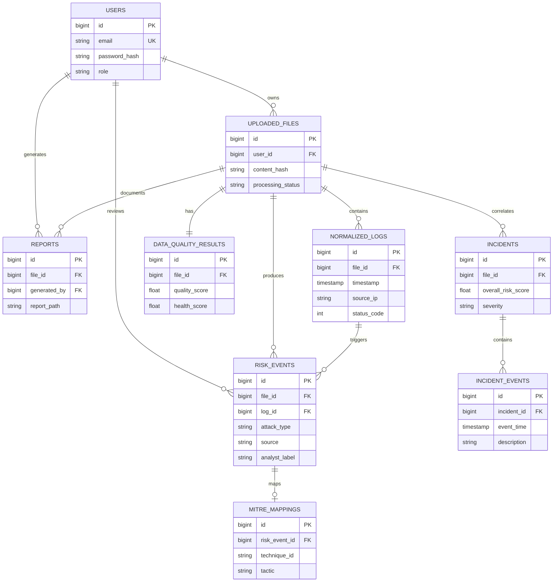

# Intelligent Log Forensics — Final Architecture Diagrams

These diagrams describe the final raw-SQL, repository-layer implementation.

## System Flow Diagram

## DFD Level 0 — Context

## DFD Level 1 — Major Processes

## DFD Level 2 — Evidence Processing

## Entity–Relationship Diagram

